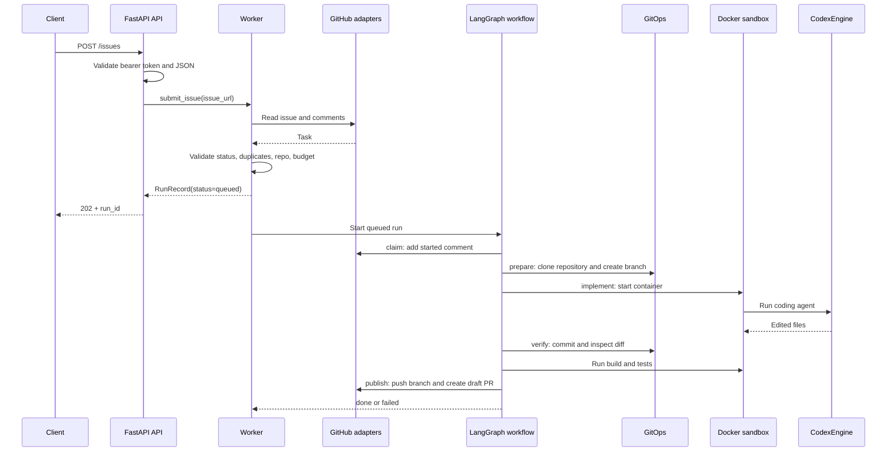

# DevAgent

DevAgent turns a GitHub issue into a draft pull request. Built with Python, FastAPI, LangGraph, Pydantic, OpenHands,
Docker, and Gitleaks, it clones the repository and creates an isolated sandbox for each task. OpenHands uses the Agent
Client Protocol (ACP) to run a local coding agent—currently Codex—inside that sandbox. DevAgent then builds, tests,
and scans the changes before opening a draft PR for review.

Design: [docs/superpowers/specs/2026-09-26-devagent-design.md](docs/superpowers/specs/2026-09-26-devagent-design.md).

## Flow diagrams

### Request flow


### Implementation workflow


### GitHub issue to draft PR sequence


### Runtime request sequence



The implementation chain remains `claim → prepare → implement → verify → publish`. Any failed step goes to
`fail`, records the error, and comments on the issue. A failed run can be retried manually.

## Submit an issue

The issue must be open and its `owner/repository` must appear in `config/agent.yaml`.
For local requests from your shell, load the same `.env` used to start the service:

```bash
set -a
source .env
set +a

curl -X POST http://127.0.0.1:8080/issues \
  -H "Authorization: Bearer $DEVAGENT_ADMIN_TOKEN" \
  -H "Content-Type: application/json" \
  -d '{"issue_url":"https://github.com/acme/booking-api/issues/42"}'
```

Accepted response:

```json
{"run_id":"90ed2bdaf65a","status":"queued"}
```

No GitHub label is required. Every run uses Codex.

The endpoint returns:

- `202` when the run is queued.
- `400` for an invalid issue URL.
- `404` when GitHub cannot find the issue.
- `409` when the issue was already submitted or already contains a devagent run comment.
- `422` for a closed issue or an unconfigured repository.
- `429` when the daily run budget is exhausted.

## Configuration

Copy the examples, then put the secret values in the Git-ignored root `.env` file:

```bash
cp config/agent.example.yaml config/agent.yaml
cp .env.example .env
# Edit .env to set GITHUB_TOKEN, DEVAGENT_ADMIN_TOKEN, and CODEX_AUTH_JSON.
uv run --env-file .env devagent check-config --config config/agent.yaml
uv run --env-file .env devagent serve --config config/agent.yaml
```

`CODEX_AUTH_JSON` is the one-line JSON content of `~/.codex/auth.json` after `codex login`.
Keep the single quotes around that value in `.env` so its JSON quotes survive parsing.
`uv run --env-file .env` loads the file for that command; `uv run` alone does not load it.
Use a long random value for `DEVAGENT_ADMIN_TOKEN`. Never commit `.env` or paste token values into issues.

Minimal configuration:

```yaml
github:
  token: ${GITHUB_TOKEN}

service:
  admin_token: ${DEVAGENT_ADMIN_TOKEN}

repos:
  - repo: {owner: acme, name: booking-api}
    base: main
    commands:
      bootstrap: "dotnet restore"
      build: "dotnet build --no-restore"
      test: "dotnet test --no-build"
```

`GITHUB_TOKEN` should be a fine-grained token scoped only to configured repositories, with:

- Contents: read and write (clone and push).
- Issues: read and write (read the task and add run comments).
- Pull requests: read and write (find or create the draft PR).
- Metadata: read (included by GitHub for fine-grained tokens).

The GitHub token stays in the orchestrator. It is not passed to the coding-agent sandbox.

## What happens during a run

1. `POST /issues` fetches the issue and comments, rejects closed, duplicate, or unconfigured issues, applies the
   daily budget, creates a queued run, and returns its ID.
2. **Claim** comments `[devagent:<run>] started` and creates a unique
   `agent/<owner-repo-issue>-<slug>-<run>` branch name.
3. **Prepare** clones the configured base branch and creates the new local branch.
4. **Implement** runs the optional bootstrap on the unchanged base, then lets Codex edit the working tree in an
   OpenHands sandbox.
5. **Verify** commits locally, rejects protected paths, symlinks, gitlinks, nested repositories and secrets, then
   runs the configured build and test commands in a fresh sandbox.
6. **Publish** pushes only the new `agent/*` branch, opens a draft PR, comments its URL on the issue, and completes
   the run.
7. **Fail** records the failed node and comments a redacted error on the issue. It never pushes a failed result.

## Guardrails

- Never pushes to an existing branch or outside `agent/*`; never force-pushes.
- Never merges, approves, closes, or marks a pull request ready.
- Never edits or closes an issue; it only reads and adds comments.
- Restricts GitHub HTTP calls to issue reads/comments and draft-PR reads/creation.
- Keeps GitHub credentials out of the sandbox, prompt, repository config, and logs.
- Rejects protected paths and secret-bearing diffs before push.
- Applies concurrent-run, daily-run, wall-clock, and optional cost limits.

> Pushing an `agent/*` branch can trigger repository CI. Configure branch policies and workflows so agent branches
> require review and cannot run untrusted changes with production secrets.

## Run API

All run endpoints require `Authorization: Bearer $DEVAGENT_ADMIN_TOKEN`:

- `GET /runs`
- `GET /runs/{id}` — includes per-node events
- `POST /runs/{id}/retry` — only failed runs; creates a fresh run and branch

Runs, events, and LangGraph checkpoints are held in memory and are lost when the orchestrator restarts. The
`[devagent:...]` issue comment still prevents the same issue from being submitted again after a restart.

## Docker Compose

```bash
cp docker/compose.example.env docker/.env
cp config/agent.example.yaml config/agent.yaml

docker compose -f docker/compose.yaml --env-file docker/.env up -d --build
```

Compose builds both the orchestrator and `devagent-sandbox:latest`. Set `INSTALL_DOTNET=false` in `docker/.env` if
your repositories do not need the .NET SDK in the Codex sandbox.

Codex uses a subscription login: run `codex login` and set `CODEX_AUTH_JSON` to the contents of
`~/.codex/auth.json`.

## Components

The API accepts an issue, the worker queues a run, and the workflow coordinates the adapters and runtime tools.
The orchestrator owns GitHub access and Git operations; the sandbox provides a workspace where Codex can edit files.

### Entry point and request handling

- [`main.py`](src/devagent/main.py) implements `devagent serve` and `devagent check-config`. On startup it loads the
  configuration, cleans up orphaned sandboxes from this deployment, builds the dependencies, starts worker threads,
  and serves the API.
- [`app/api.py`](src/devagent/app/api.py) defines the FastAPI routes. It checks the admin bearer token for issue and
  run operations, translates intake errors into HTTP responses, and exposes an unauthenticated `/health` endpoint.
- [`app/worker.py`](src/devagent/app/worker.py) validates submitted issues against their GitHub status, earlier runs,
  issue comments, configured repositories, and the daily budget. It stores accepted runs, queues them, and processes
  them with up to `max_concurrent` worker threads. A retry creates a new run for a failed one.
- [`app/factories.py`](src/devagent/app/factories.py) constructs the GitHub tracker, GitHub code host, and Codex engine.
  It also collects configured secret values for redaction.

### Workflow

- [`workflow/state.py`](src/devagent/workflow/state.py) defines the data passed between steps: the task, branch,
  checkout path, engine result, verification result, PR, and any failure. Its `Deps` bundle supplies the adapters and
  runtime tools to each step.
- [`workflow/graph.py`](src/devagent/workflow/graph.py) connects the steps with LangGraph, records start/finish/error
  events, checkpoints state in memory, and routes a step error to `fail`. It does not retry steps automatically.
- [`workflow/nodes/claim.py`](src/devagent/workflow/nodes/claim.py) chooses the new branch, marks the run as running,
  and comments on the issue. [`prepare.py`](src/devagent/workflow/nodes/prepare.py) clones the configured base branch
  and creates that branch locally.
- [`workflow/nodes/implement.py`](src/devagent/workflow/nodes/implement.py) builds the prompt, optionally runs the
  repository bootstrap command, and asks Codex to implement the issue inside a sandbox.
  [`verify.py`](src/devagent/workflow/nodes/verify.py) commits the changes locally, checks paths, file types, and
  secrets, then runs the configured build and test commands in a fresh sandbox.
- [`workflow/nodes/publish.py`](src/devagent/workflow/nodes/publish.py) pushes the verified branch, creates or reuses
  its draft PR, comments the PR URL on the issue, and completes the run.
  [`fail.py`](src/devagent/workflow/nodes/fail.py) records the failure and comments a redacted error.
  [`shared.py`](src/devagent/workflow/nodes/shared.py) contains common repository, command, and comment helpers.

### GitHub and coding adapters

- [`providers/trackers/`](src/devagent/providers/trackers/) defines the task-tracker interface and its GitHub issue
  adapter. The adapter parses issue URLs, reads issues and comments, and posts run comments.
- [`providers/code_hosts/`](src/devagent/providers/code_hosts/) defines repository and PR operations. Its GitHub
  adapter supplies the clone URL and push authentication, finds open PRs, and creates draft PRs.
- [`providers/engines/`](src/devagent/providers/engines/) defines the coding-engine interface. `CodexEngine` runs
  Codex through OpenHands and ACP, applies time and optional cost limits, and returns a redacted result.

### Configuration, safety, and runtime

- [`core/config.py`](src/devagent/core/config.py) loads `agent.yaml`, substitutes `${VAR}` values from the environment,
  and validates GitHub, Codex, repository, budget, guardrail, sandbox, Git identity, and service settings.
  [`core/models.py`](src/devagent/core/models.py) holds the shared task, repository, PR, run, and engine data models.
- [`core/slug.py`](src/devagent/core/slug.py) creates branch-safe names from issue details.
  [`core/guardrails.py`](src/devagent/core/guardrails.py) checks push targets, changed paths and file types, daily
  budgets, and known secrets; it also redacts those secrets from output.
- [`runtime/sandbox.py`](src/devagent/runtime/sandbox.py) starts a separate OpenHands Docker container per sandbox
  session. The repository is writable there, but `.git` is read-only; the orchestrator removes the container when
  the session ends and reaps orphaned containers at startup.
- [`runtime/gitops.py`](src/devagent/runtime/gitops.py) performs clone, branch, commit, diff, and push operations in
  the orchestrator with isolated Git settings. [`runtime/http.py`](src/devagent/runtime/http.py) allows provider HTTP
  requests only when their method and path match an explicit rule.
- [`runtime/secretscan.py`](src/devagent/runtime/secretscan.py) runs Gitleaks on the diff and fails verification if
  scanning fails. [`runtime/logging.py`](src/devagent/runtime/logging.py) emits structured JSON logs with known
  secrets masked.
- [`runtime/storage.py`](src/devagent/runtime/storage.py) opens the process-local run store and LangGraph's in-memory
  checkpointer. [`db/tables.py`](src/devagent/db/tables.py) defines the SQLite run and event tables, while
  [`db/store.py`](src/devagent/db/store.py) creates, updates, lists, and retries runs. SQLite is in memory, so these
  records and checkpoints disappear when the process stops.
- [`prompts/`](src/devagent/prompts/) combines the issue and comments with local coding rules. It marks issue text as
  untrusted task data before sending the prompt to Codex.

### Deployment and supporting files

- [`config/agent.example.yaml`](config/agent.example.yaml) shows repository commands and service settings;
  [`.env.example`](.env.example) lists the environment variables used for secrets. Copy these to the ignored
  `config/agent.yaml` and `.env` files for a local service.
- [`docker/compose.yaml`](docker/compose.yaml) runs the orchestrator and Caddy and builds the sandbox image.
  [`docker/orchestrator.Dockerfile`](docker/orchestrator.Dockerfile) packages the API, worker, Docker CLI, and
  Gitleaks; [`docker/sandbox.Dockerfile`](docker/sandbox.Dockerfile) packages the OpenHands agent server, Codex ACP
  adapter, and optional .NET toolchain. [`docker/Caddyfile`](docker/Caddyfile) proxies only `/issues` and `/health`.
- [`tests/`](tests/) covers configuration, the API, issue intake, and the GitHub tracker. [`docs/`](docs/) contains
  the design specification and the diagrams shown above.

## Next implementations

These capabilities were intentionally removed from the first version and can be added after the GitHub-to-PR flow
is stable:

- PostgreSQL persistence for runs, events, and LangGraph checkpoints, including restart recovery.
- GitHub webhooks or polling for automatic issue intake.
- Additional task and code-host providers: ClickUp, Trello, and Azure DevOps.
- Additional coding engines, including Claude Code, with explicit engine selection.

## Development

```bash
uv sync
uv run pytest
uv run pyright
uv run --env-file .env devagent check-config --config config/agent.yaml
```
