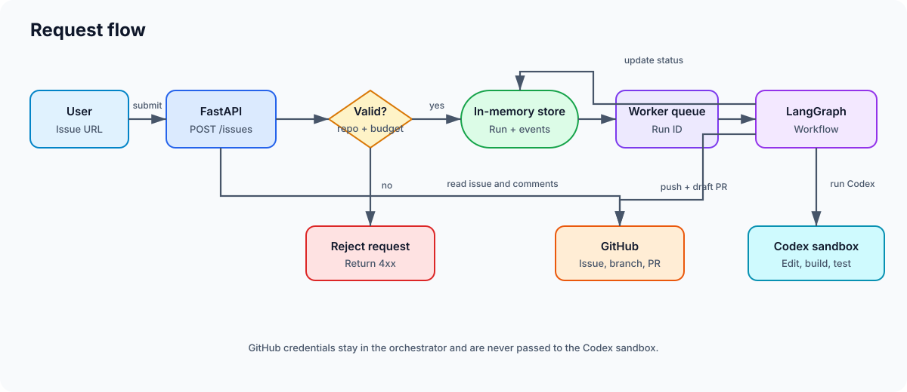
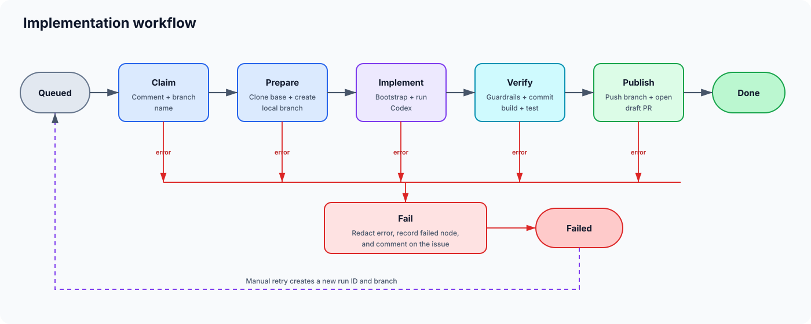
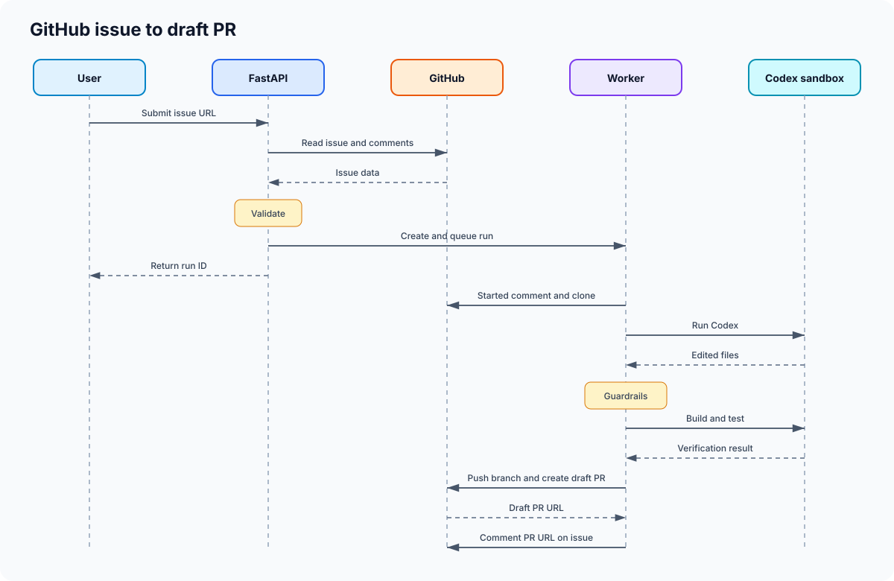

# devagent

Devagent turns a GitHub issue into an implemented **draft pull request**.

Send an open issue URL to one endpoint. Devagent reads the issue, clones its repository, creates a new branch, runs
Codex, verifies the result, pushes the branch, and opens a draft PR for human review.

GitHub is the only task source and code host. There are no tracker webhooks, polling jobs, or provider-selection
settings.

Design: [docs/superpowers/specs/2026-09-26-devagent-design.md](docs/superpowers/specs/2026-09-26-devagent-design.md).

## Flow diagrams

### Request flow



### Implementation workflow



### GitHub issue to draft PR sequence



The implementation chain remains `claim → prepare → implement → verify → publish`. Any failed step goes to
`fail`, records the error, and comments on the issue. A failed run can be retried manually.

## Submit an issue

The issue must be open and its `owner/repository` must appear in `config/agent.yaml`.

```bash
curl -X POST https://agent.example.com/issues \
  -H "Authorization: Bearer $DEVAGENT_ADMIN_TOKEN" \
  -H "Content-Type: application/json" \
  -d '{"issue_url":"https://github.com/acme/booking-api/issues/42"}'
```

Accepted response:

```json
{"run_id":"90ed2bdaf65a","status":"queued"}
```

No GitHub label is required. Every run uses Codex.

The endpoint returns:

- `202` when the run is queued.
- `400` for an invalid issue URL.
- `404` when GitHub cannot find the issue.
- `409` when the issue was already submitted or already contains a devagent run comment.
- `422` for a closed issue or an unconfigured repository.
- `429` when the daily run budget is exhausted.

## Configuration

Copy the example and set secrets through environment variables:

```bash
cp config/agent.example.yaml config/agent.yaml
export GITHUB_TOKEN=github_pat_...
export DEVAGENT_ADMIN_TOKEN=change-me-long-random
export CODEX_AUTH_JSON="$(cat ~/.codex/auth.json)"
```

Minimal configuration:

```yaml
github:
  token: ${GITHUB_TOKEN}

service:
  admin_token: ${DEVAGENT_ADMIN_TOKEN}

repos:
  - repo: {owner: acme, name: booking-api}
    base: main
    commands:
      bootstrap: "dotnet restore"
      build: "dotnet build --no-restore"
      test: "dotnet test --no-build"
```

`GITHUB_TOKEN` should be a fine-grained token scoped only to configured repositories, with:

- Contents: read and write (clone and push).
- Issues: read and write (read the task and add run comments).
- Pull requests: read and write (find or create the draft PR).
- Metadata: read (included by GitHub for fine-grained tokens).

The GitHub token stays in the orchestrator. It is not passed to the coding-agent sandbox.

## What happens during a run

1. `POST /issues` fetches the issue and comments, rejects closed, duplicate, or unconfigured issues, applies the
   daily budget, creates a queued run, and returns its ID.
2. **Claim** comments `[devagent:<run>] started` and creates a unique
   `agent/<owner-repo-issue>-<slug>-<run>` branch name.
3. **Prepare** clones the configured base branch and creates the new local branch.
4. **Implement** runs the optional bootstrap on the unchanged base, then lets Codex edit the working tree in an
   OpenHands sandbox.
5. **Verify** commits locally, rejects protected paths, symlinks, gitlinks, nested repositories and secrets, then
   runs the configured build and test commands in a fresh sandbox.
6. **Publish** pushes only the new `agent/*` branch, opens a draft PR, comments its URL on the issue, and completes
   the run.
7. **Fail** records the failed node and comments a redacted error on the issue. It never pushes a failed result.

## Guardrails

- Never pushes to an existing branch or outside `agent/*`; never force-pushes.
- Never merges, approves, closes, or marks a pull request ready.
- Never edits or closes an issue; it only reads and adds comments.
- Restricts GitHub HTTP calls to issue reads/comments and draft-PR reads/creation.
- Keeps GitHub credentials out of the sandbox, prompt, repository config, and logs.
- Rejects protected paths and secret-bearing diffs before push.
- Applies concurrent-run, daily-run, wall-clock, and optional cost limits.

> Pushing an `agent/*` branch can trigger repository CI. Configure branch policies and workflows so agent branches
> require review and cannot run untrusted changes with production secrets.

## Run API

All run endpoints require `Authorization: Bearer $DEVAGENT_ADMIN_TOKEN`:

- `GET /runs`
- `GET /runs/{id}` — includes per-node events
- `POST /runs/{id}/retry` — only failed runs; creates a fresh run and branch

Runs, events, and LangGraph checkpoints are held in memory and are lost when the orchestrator restarts. The
`[devagent:...]` issue comment still prevents the same issue from being submitted again after a restart.

## Docker Compose

```bash
cp docker/compose.example.env docker/.env
cp config/agent.example.yaml config/agent.yaml

docker compose -f docker/compose.yaml --env-file docker/.env up -d --build
```

Compose builds both the orchestrator and `devagent-sandbox:latest`. Set `INSTALL_DOTNET=false` in `docker/.env` if
your repositories do not need the .NET SDK in the Codex sandbox.

Codex uses a subscription login: run `codex login` and set `CODEX_AUTH_JSON` to the contents of
`~/.codex/auth.json`.

## Project structure

```text
src/devagent/
├── main.py       # CLI entry point and composition
├── app/          # HTTP API, issue intake, and worker scheduling
├── core/         # Configuration, models, branch naming, and guardrails
├── runtime/      # Git, sandbox, storage, HTTP, logging, and secret scanning
├── workflow/     # claim → prepare → implement → verify → publish
├── providers/    # GitHub and Codex adapters
├── db/           # In-memory run/event tables and store
└── prompts/      # Codex prompt construction and local rules
```

## Next implementations

These capabilities were intentionally removed from the first version and can be added after the GitHub-to-PR flow
is stable:

- PostgreSQL persistence for runs, events, and LangGraph checkpoints, including restart recovery.
- GitHub webhooks or polling for automatic issue intake.
- Additional task and code-host providers: ClickUp, Trello, and Azure DevOps.
- Additional coding engines, including Claude Code, with explicit engine selection.

## Development

```bash
uv sync
uv run pytest
uv run pyright
uv run devagent check-config --config config/agent.yaml
```
